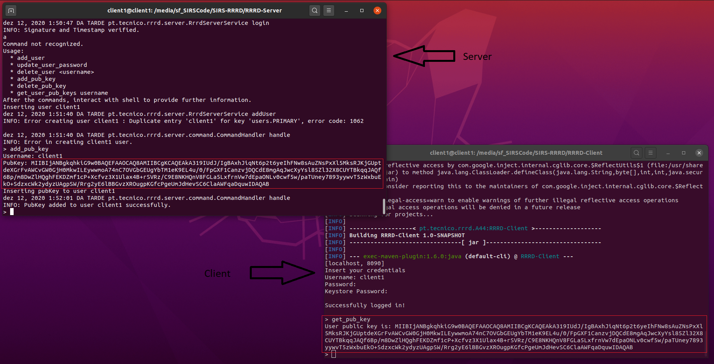
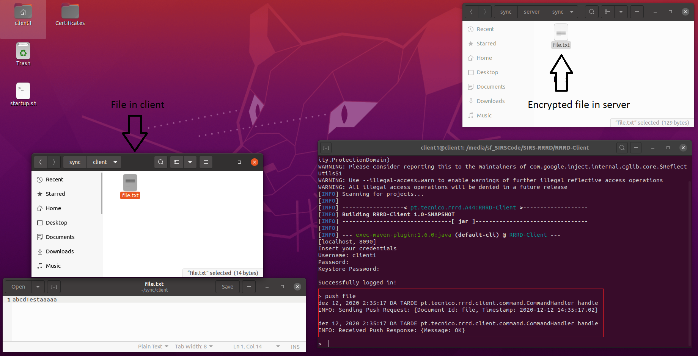

Instituto Superior Técnico, Universidade de Lisboa

**Network and Computer Security**

#Project - Ransomware Resistant Remote Documents
##Group 44

## Required platform
The required platform to run this project is Linux 64-bit, Ubuntu 20.04.1 LTS, Java 11 and MySQL.

## Setup
**We refer to the directory SIRS-RRRD as <project-root>**

### Create the database
The system needs a database to run

A database can be created with MySQL [MySQL](https://www.mysql.com/)
To do so first you need to install MySQL by running:

```bash
$ sudo apt install mysql-server
```

To setup the databse:

```bash
$ sudo mysql -u root
```

```sql
mysql> CREATE DATABASE db;
```

To create a user:

```sql
mysql> CREATE USER '<username>'@'localhost' IDENTIFIED BY '<password>';
```

```sql
mysql> GRANT ALL PRIVILEGES ON db.* TO '<username>'@'localhost';
```

Create a ```database.properties``` file in ```<project-root>/RRRD-Server/src/main/java/pt/tecnico/rrrd/server/database with the following```:

```text
#Database Properties
jdbcDriver=com.mysql.cj.jdbc.Driver
dbUrl=jdbc:mysql://localhost:3306/db
dbUser=<username>
dbPassword=<password>
```

Where ```<username>``` and ```<password>``` should be replaced by the username and password of the previously created database user.

Populate the database:

```bash
$ cd <project-root>/RRRD-Server/src/main/java/pt/tecnico/rrrd/server/database
$ mysql -u <username> -p db < populate_server.sql
```

### Create the necessary folder structure
Create the client folder structure:

```bash
$ mkdir -p ~/sync/client/
```

Create the server folder structure:
```bash
$ mkdir -p ~/sync/server/sync/
$ mkdir -p ~/sync/server/serverDbBackup/
```

Create the backup server folder structure:

```bash
$ mkdir ~/backup/
```

Create the ```currentVersion.txt``` file in ```<project-root>/RRRD-Backup/```

```bash
$ echo 0 > ./currentVersion.txt
```

Each virtual machine also needs a keystore in the home directory ```~/KeyStore.jks```
### Compile the code

The code can be compiled using [Maven](https://maven.apache.org/).
To do so at the root of the project ```<project-root>``` run:

```bash
$ mvn clean install
```

## Run Project
### Server

To run the server:

```bash
$ cd <project-root>/RRRD-Server
$ mvn exec:java
```

To add new user:

```bash
> add_user
Username: client1
Password: client1
```
Then the user needs to provide his public key to the system admin that can add it to the server by running:

```bash
> add_pub_key
Username: client1
Pubkey: <The public key obtained bu running the get_pub_key in the client>
```



Now that we have a user in the registered in the server we can run some commands in the client

### Client

To run the client:

```bash
$ cd <project-root>/RRRD-Client
$ mvn exec:java
```

To login:

```bash
Username: client1
Password: client1
Keystore Password: password
```

To get the public key of the logged in user:

```bash
> get_pub_key
```

To add a new file first we need to create a new file in ```~/sync/client/```:

```bash
$ cd ~/sync/client/
$ echo abcdTest > ./file.txt
```

Then to store the file in the server the user needs to login into the client application and run:

```bash
> add_file file
```


After altering ```~/sync/client/file.txt``` to push is to the server:

```bash
> push file
```



For simplicity to demonstrate the pull functionality delete the previously added file ```~/sync/client/``` and then pull it from the server:

```bash
> rm ~/sync/client/file.txt
```

Then login into the client application and run:

```bash
> pull file
```


As we can se in the previous image, the contents of the file are equal to the data that was in the file when the last push was executed.

To delete a file:

```bash
> delete_file file
```


### Backup

To the backupServer:

```bash
$ cd 
```
In server mvn exec:java -Dexec.args="localhost 8080 terminal" -P backup-client